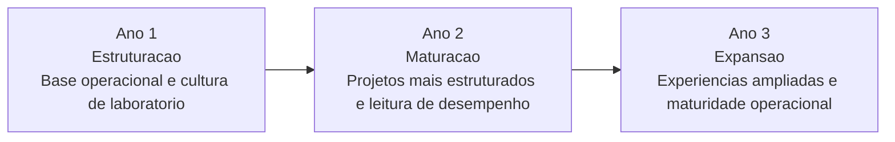
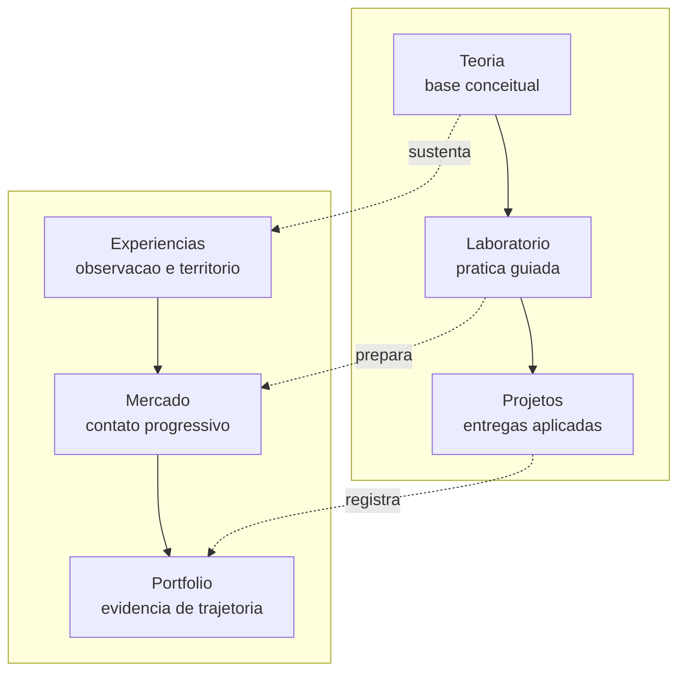
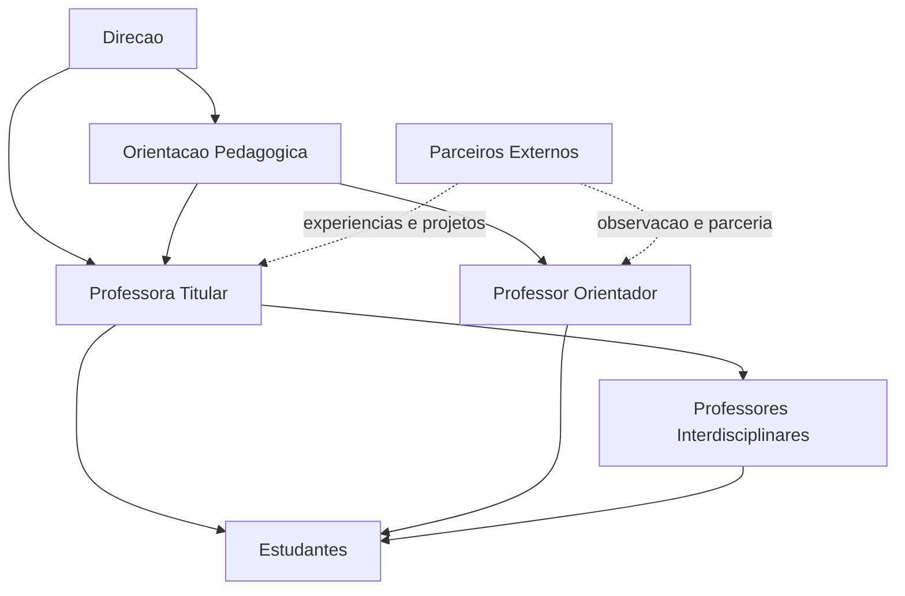
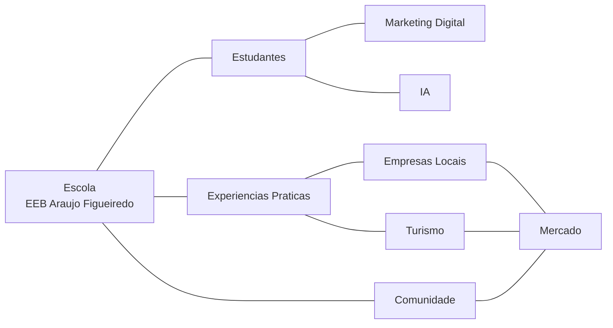
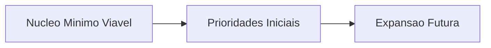
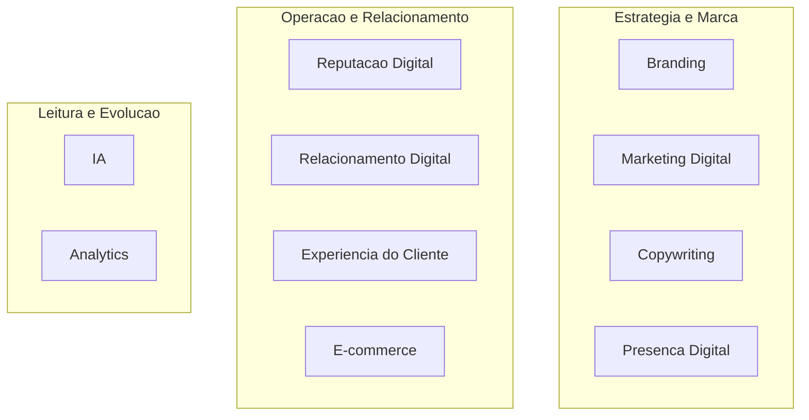

# Pacote Final de Ativos Visuais Executivos
## Araujo Innovation Lab
### Estruturas para Google Slides, Google Docs e PDFs Institucionais

---

> **Classificacao:** Documento Institucional - Sistema Visual Executivo  
> **Aplicacao:** Google Slides, Google Docs, PDFs institucionais e materiais de apresentacao  
> **Publico-alvo:** direcao, coordenacao, designer institucional, equipe pedagogica e responsaveis por apresentacoes  
> **Objetivo:** consolidar os ativos visuais finais do Araujo Innovation Lab em um unico pacote de producao, com unidade institucional, legibilidade executiva e consistencia educacional

---

## 1. Diretriz Central do Pacote

Este pacote visual deve comunicar, de forma integrada:

- maturidade institucional;
- inovacao educacional com sobriedade;
- realismo operacional;
- clareza de governanca;
- continuidade;
- sustentabilidade;
- modernizacao educacional.

Todos os ativos devem parecer parte de um mesmo sistema. A referencia visual nao e um deck comercial. E uma linguagem institucional premium, capaz de sustentar:

- apresentacoes executivas;
- frameworks e documentos;
- relatorios estrategicos;
- materiais de parceria;
- PDFs institucionais.

Principios permanentes:

- pouco ruido visual;
- espacamento generoso;
- hierarquia forte;
- iconografia leve;
- leitura rapida;
- credibilidade acima de impacto cenografico.

---

## 2. Roadmap Visual Final

### 2.1 Funcao do Ativo

Representar a **Implementacao Progressiva** em tres anos, transmitindo controle, pacing e maturacao institucional.

### 2.2 Estrutura Visual

- eixo horizontal central;
- tres marcos principais;
- um nivel de leitura primario por ano;
- um nivel de leitura secundario para foco e marco;
- destaque sutil no Ano 2 como ponto de consolidacao.

### 2.3 Hierarquia de Conteudo

- titulo do ativo;
- subtitulo curto de leitura executiva;
- anos como marcos principais;
- foco do ano em uma linha;
- marco institucional em uma linha menor.

### 2.4 Composicao para Slides

- ocupar de 55% a 65% da largura do slide;
- manter 15% de respiro acima e abaixo;
- usar icones discretos acima de cada ano;
- aplicar azul profundo na linha base;
- usar dourado suave apenas no ponto de virada ou consolidacao.

### 2.5 Composicao para Docs

- versao horizontal para paginas A4 em paisagem;
- versao vertical simplificada quando inserido em documento retrato;
- legenda curta abaixo do ativo;
- no maximo duas linhas explicativas por etapa.

### 2.6 Icones Recomendados

- Ano 1: estrutura ou base;
- Ano 2: consolidacao ou articulacao;
- Ano 3: expansao responsavel ou alcance.

### 2.7 Mermaid Base

### 2.8 Regra de Uso

Este roadmap deve sempre parecer uma trilha de amadurecimento, nunca uma esteira de promessas.

---

## 3. Matriz 6D Final Visual

### 3.1 Funcao do Ativo

Transformar a **Matriz 6D de Aprendizagem** em um dos visuais-assinatura do projeto.

### 3.2 Estrutura Recomendada

- grid 2x3;
- seis cartoes de mesma largura;
- sem linhas excessivas entre blocos;
- subtitulo curto no topo explicando que as dimensoes operam de forma complementar.

### 3.3 Ordem Recomendada de Leitura

Linha 1:

- Teoria;
- Laboratorio;
- Projetos.

Linha 2:

- Experiencias;
- Mercado;
- Portfolio.

### 3.4 Hierarquia Interna de Cada Cartao

- icone no topo;
- nome da dimensao;
- microfrase de funcao;
- uma linha curta de impacto pedagogico.

### 3.5 Respiro Visual

- espacamento minimo de 20 a 24 px entre cartoes em Slides;
- margem interna generosa;
- fundo branco ou cinza muito claro;
- borda fina ou sombra praticamente inexistente.

### 3.6 Adaptacao para Slides

- usar o grid como visual principal do slide;
- evitar bullets paralelos fora da matriz;
- deixar a progressao por anos fora do grid, em faixa inferior discreta.

### 3.7 Adaptacao para Docs

- versao em tabela visual 2x3;
- cada bloco com borda fina;
- legenda curta abaixo: "dimensoes complementares da formacao aplicada".

### 3.8 Mermaid Base

### 3.9 Regra de Uso

A Matriz 6D deve parecer clara e memoravel. Nao deve parecer diagrama tecnico excessivamente articulado.

---

## 4. Diagrama Final de Governanca

### 4.1 Funcao do Ativo

Mostrar coordenacao institucional sem transmitir burocracia.

### 4.2 Estrutura Recomendada

- tres faixas horizontais;
- poucos blocos por faixa;
- conexoes verticais simples;
- parceiros externos posicionados lateralmente, nao dentro da cadeia central.

### 4.3 Hierarquia

Faixa 1:

- Direcao.

Faixa 2:

- Orientacao Pedagogica;
- Professora Titular;
- Professor Orientador.

Faixa 3:

- Professores Interdisciplinares;
- Estudantes.

Lateral:

- Parceiros Externos.

### 4.4 Logica de Fluxo

- Direcao valida e sustenta;
- Orientacao Pedagogica acompanha;
- Professora Titular e Professor Orientador organizam a operacao;
- Professores Interdisciplinares apoiam a formacao;
- Estudantes executam e aprendem;
- Parceiros Externos interagem por projetos e experiencias.

### 4.5 Adaptacao para Slides

- ocupar no maximo 60% da area central;
- deixar texto explicativo curto abaixo;
- usar conectores retos e discretos.

### 4.6 Adaptacao para Docs

- versao vertical simplificada;
- legenda lateral: "fluxo de sustentacao institucional e operacao pedagogica".

### 4.7 Mermaid Base

### 4.8 Regra de Uso

O diagrama deve transmitir sustentacao, acompanhamento e clareza de papeis. Nunca um organograma pesado.

---

## 5. Mapa Final do Ecossistema Educacional

### 5.1 Funcao do Ativo

Comunicar transformacao educacional regional integrada.

### 5.2 Estrutura Recomendada

- escola no centro;
- primeira camada com estudantes e experiencias praticas;
- segunda camada com comunidade, empresas locais, turismo e mercado;
- camada de apoio conceitual com marketing digital e IA.

### 5.3 Leitura Recomendada

- centro: escola e laboratorio;
- entorno imediato: estudantes e aprendizagem aplicada;
- entorno regional: comunidade e economia local;
- suporte transversal: marketing digital e IA como ferramentas de conexao.

### 5.4 Adaptacao para Slides

- usar formato radial;
- icones pequenos e consistentes;
- nomes curtos em cada nodo;
- evitar textos longos dentro do mapa.

### 5.5 Adaptacao para Docs

- preferir versao circular simplificada;
- incluir uma legenda de 3 linhas logo abaixo.

### 5.6 Mermaid Base

### 5.7 Regra de Uso

Este mapa deve parecer um ecossistema vivo e coordenado, nao um mapa de stakeholders excessivamente tecnico.

---

## 6. MVP Visual Final

### 6.1 Funcao do Ativo

Comunicar implementacao controlada, gradual e sustentavel.

### 6.2 Estrutura Recomendada

- bloco principal do nucleo minimo viavel;
- bloco lateral de prioridades iniciais;
- bloco lateral de expansao futura;
- rodape com principio de sustentabilidade.

### 6.3 Composicao para Slides

- centro com nucleo MVP;
- esquerda com "o que entra primeiro";
- direita com "o que amadurece depois";
- base com frase de controle de complexidade.

### 6.4 Composicao para Docs

- tabela em tres colunas;
- cabecalhos: `nucleo`, `prioridades iniciais`, `expansao futura`;
- faixa final com principio institucional.

### 6.5 Conteudo Estrutural

**Nucleo minimo viavel**

- branding institucional basico;
- redes sociais institucionais;
- Google Meu Negocio;
- copywriting introdutorio;
- laboratorio simplificado;
- portfolio leve;
- introducao a IA;
- reputacao digital;
- 1 projeto integrador;
- experiencias observacionais.

**Prioridades iniciais**

- funcionamento regular;
- apoio docente;
- registro essencial;
- visibilidade institucional;
- primeiros resultados concretos.

**Expansao futura**

- automacao moderada;
- analytics mais robusto;
- projetos ampliados;
- mais relacoes com mercado;
- maturidade operacional.

### 6.6 Mermaid Base

### 6.7 Regra de Uso

O ativo deve reduzir ansiedade. Ele precisa parecer sob controle desde a primeira leitura.

---

## 7. Infografico Final dos Pilares de Marketing Digital

### 7.1 Funcao do Ativo

Organizar os pilares tecnicos do laboratorio de forma moderna, mas institucional.

### 7.2 Estrutura Recomendada

Agrupar em tres familias:

- **Estrategia e Marca**
- **Operacao e Relacionamento**
- **Leitura e Evolucao**

### 7.3 Distribuicao dos Pilares

**Estrategia e Marca**

- Branding;
- Marketing Digital;
- Copywriting;
- Presenca Digital.

**Operacao e Relacionamento**

- Reputacao Digital;
- Relacionamento Digital;
- Experiencia do Cliente;
- E-commerce.

**Leitura e Evolucao**

- IA;
- Analytics.

### 7.4 Composicao Visual

- tres blocos principais;
- cada bloco com 3 ou 4 microcartoes;
- icone unico por pilar;
- fundo claro com divisao por cor sutil.

### 7.5 Adaptacao para Slides

- usar o infografico como visual principal;
- sem adicionar longas listas ao lado;
- reforcar apenas um takeaway por grupo.

### 7.6 Adaptacao para Docs

- infografico em largura total;
- legenda curta sob cada familia.

### 7.7 Mermaid Base

### 7.8 Regra de Uso

O infografico deve parecer um mapa de competencias aplicadas, nao uma listagem tecnica de modulos.

---

## 8. Composicoes de Capa

### 8.1 Documento Master

- titulo no terco superior esquerdo;
- subtitulo curto logo abaixo;
- assinatura institucional no rodape;
- uma unica faixa vertical ou horizontal discreta em azul profundo;
- visual mais solene e estrategico.

### 8.2 Framework Operacional

- composicao mais estrutural;
- titulo forte;
- subtitulo em menor peso;
- pequeno bloco lateral com classificacao documental;
- sensacao de ordem e estabilidade.

### 8.3 Slides Executivos

- titulo grande em duas linhas no maximo;
- subtitulo funcional;
- assinatura institucional na base;
- sem fotografia na capa principal, salvo uso muito sutil do territorio.

### 8.4 PDF Institucional

- herda a capa do documento de origem;
- reforcar cabecalho e rodape institucionais;
- equilibrio entre sobriedade e legibilidade.

### 8.5 Regra Comum de Ritmo

- titulo;
- subtitulo;
- assinatura;
- espaco em branco;
- um unico gesto visual institucional.

---

## 9. Sistema Final de Iconografia

### 9.1 Familia Recomendada

- line icons;
- traco de 1.5 px a 2 px;
- cantos suaves;
- sem preenchimento pesado;
- sem detalhes decorativos excessivos.

### 9.2 Regras de Consistencia

- todos os icones devem pertencer a uma mesma familia;
- espessura constante;
- proporcao semelhante;
- uso monocromatico ou bicromatico muito contido.

### 9.3 Aplicacoes

- roadmaps;
- matrizes;
- governanca;
- ecossistemas;
- slides divisores;
- blocos executivos em Docs.

### 9.4 Regra de Moderacao

- um icone por bloco principal;
- evitar repeticao ornamental;
- nunca competir com o titulo.

---

## 10. Implementacao em Google Slides

### 10.1 Espacamento

- margem lateral de 6% a 8%;
- margem superior de 5% a 7%;
- margem inferior de 5% a 7%;
- separar titulo e visual principal com respiro claro.

### 10.2 Tamanho de Infograficos

- infografico principal deve ocupar entre 45% e 60% da area util;
- legenda e takeaway devem caber sem pressionar o rodape;
- evitar mais de um grande diagrama por slide.

### 10.3 Roadmap

- preferencia por posicao central horizontal;
- texto complementar abaixo, nunca ao redor em excesso.

### 10.4 Texto e Imagem

- slides explicativos: 50/50;
- slides de decisao: 60/40;
- slides de impacto institucional: 30/70.

### 10.5 Controle de Branco

- sempre reservar um campo visual vazio;
- se o slide parecer "consultoria pesada", remover elementos antes de adicionar outros.

### 10.6 Ritmo de Transicao

- nao repetir dois slides densos de matriz ou diagrama em sequencia sem um slide de respiracao;
- usar divisores para mudar de bloco;
- alternar visual, texto curto e timeline.

---

## 11. Implementacao em Google Docs

### 11.1 Insercao de Infograficos

- sempre centralizados ou alinhados ao eixo principal da pagina;
- com legenda curta logo abaixo;
- com margem vertical acima e abaixo.

### 11.2 Ritmo do Documento

- um ativo relevante a cada 2 ou 3 paginas em documentos longos;
- nao concentrar multiplos diagramas na mesma abertura de secao;
- alternar texto corrido, bloco de destaque e visual.

### 11.3 Legibilidade Executiva

- preferir infograficos horizontais curtos;
- se o diagrama exigir leitura lenta, transformar em quadro dividido;
- manter textos dentro dos visuais em nivel minimo.

### 11.4 Consistencia Institucional

- usar sempre a mesma paleta;
- repetir estilo de borda, titulo e legenda;
- manter padrao de caption institucional.

---

## 12. Validacao Final de Consistencia

Todos os ativos deste pacote devem ser avaliados segundo seis perguntas:

1. parecem parte do mesmo sistema?
2. sao legiveis em apresentacao ao vivo?
3. preservam sobriedade institucional?
4. reforcam educacao aplicada sem exagero tecnico?
5. transmitem maturidade e controle?
6. mantem respiro visual suficiente?

Se a resposta for negativa em qualquer item, o ativo precisa ser simplificado antes de ser publicado.

### 12.1 Sintese Final

O pacote visual final do Araujo Innovation Lab deve parecer:

- elegante;
- institucional;
- educacional;
- moderno;
- integrado;
- escalavel;
- confiavel.

Esse e o criterio central. Nao impressionar pelo excesso. Convencer pela clareza.
